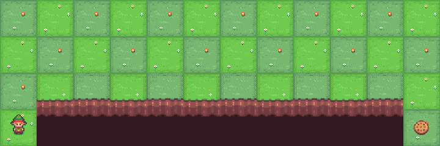
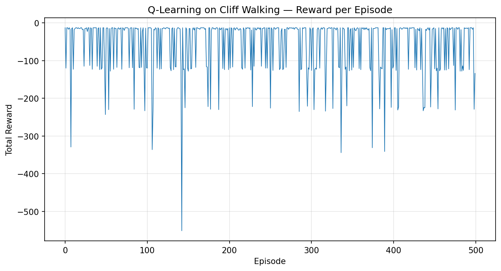

# 🧗 Cliff Walking — Q-Learning

<div align="center">

**A tabular Q-Learning agent that learns to cross a cliff without falling — from scratch, no libraries beyond NumPy.**


</div>

<p align="center">
  
  <br>
  <em>The trained agent hugging the safe edge — the optimal 13-step path.</em>
</p>

---

## 🎯 What this is

[Cliff Walking](https://gymnasium.farama.org/environments/toy_text/cliff_walking/) is a classic gridworld benchmark from Sutton & Barto's *Reinforcement Learning: An Introduction*. An agent starts at the bottom-left of a 4×12 grid and must reach the bottom-right goal — but the entire bottom row between them is a cliff. Step off the edge and it's a **−100 penalty**, teleported back to start. Every other step costs **−1**, so the agent is under constant pressure to find the *shortest safe path*, not just *a* safe path.

This repo implements **Q-Learning** — an off-policy, model-free temporal-difference algorithm — to solve it, purely with NumPy and Gymnasium.

## 🧠 Why Cliff Walking is a great Q-Learning demo

It's small enough to solve in seconds, but it exposes a real, well-documented quirk: because Q-Learning is **off-policy** (it learns the value of the *greedy* policy while *behaving* epsilon-greedily), it converges to the **optimal, risky path** — walking right along the cliff edge. SARSA, its on-policy cousin, learns a **safer, longer path** instead because it accounts for its own exploration mistakes. Solving both (see the companion [SARSA repo](#-related)) makes that difference concrete instead of theoretical.

## ⚙️ How it works

**State space:** 48 discrete states (4×12 grid, flattened)
**Action space:** 4 discrete actions — `up`, `right`, `down`, `left`
**Policy:** ε-greedy over a `(48, 4)` Q-table, initialized to all zeros

The core update, applied after every step:

```
Q(s, a) ← Q(s, a) + α [ r + γ · max_a' Q(s', a') − Q(s, a) ]
```

| Symbol | Meaning | Value used |
|---|---|---|
| `α` (alpha) | learning rate | `0.5` |
| `γ` (gamma) | discount factor | `0.99` |
| `ε` (epsilon) | exploration rate | `0.1` (fixed) |
| episodes | training runs | `500` |

Because the `max` in the update looks at the **best possible next action** — regardless of what the agent actually does next — Q-Learning is learning the optimal policy "on the side" while still exploring. That's the off-policy property in one line of math.

## 📈 Results

<p align="center">
  
</p>

| Metric | Result |
|---|---|
| Optimal path length | 13 steps |
| Optimal episode reward | −13 |
| Episodes to convergence | ~100–150 |
| Final greedy-policy reward | **−13** (optimal) |

The agent reliably converges to the mathematically optimal path — the shortest route hugging the cliff edge — within the first ~150 of 500 training episodes.

## 🚀 Running it yourself

```bash
git clone https://github.com/sumitjhadev/cliffwalking-qlearning.git
cd cliffwalking-qlearning
pip install -r requirements.txt
jupyter notebook notebooks/q_learning_cliffwalking.ipynb
```

Or open it directly in Colab:

[](https://colab.research.google.com/github/sumitjhadev/cliffwalking-qlearning/blob/main/notebooks/q_learning_cliffwalking.ipynb)

## 📁 Repo structure

```
cliffwalking-qlearning/
├── notebooks/
│   └── q_learning_cliffwalking.ipynb   # full training + evaluation
├── assets/
│   ├── learning_curve.png              # reward-per-episode plot
│   └── agent_demo.gif                  # trained agent, rendered
├── requirements.txt
├── LICENSE
└── README.md
```

## 🔗 Related

- [`cliffwalking-sarsa`](https://github.com/sumitjhadev/cliffwalking-sarsa) — the on-policy counterpart, solved on the same environment for direct comparison.

## 📄 License

MIT — see [LICENSE](LICENSE).
